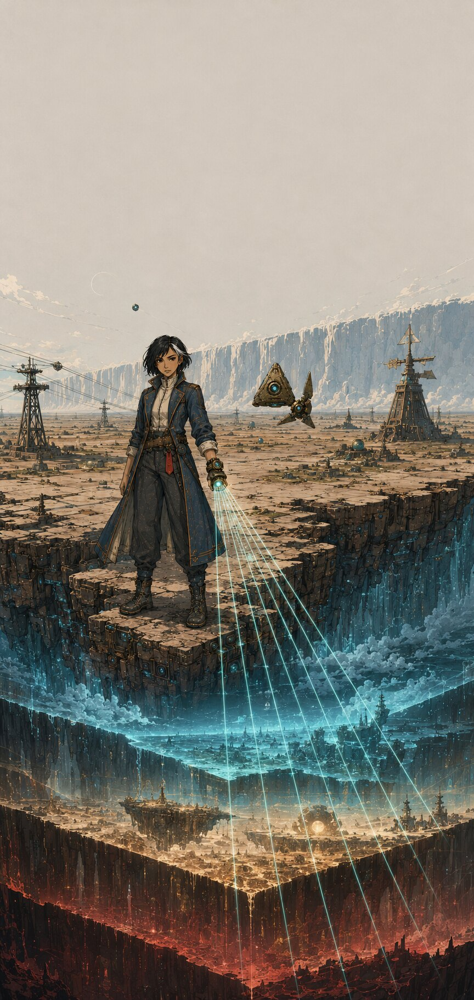

# Cửu Tầng Phẳng

> Một truyện tranh khoa học viễn tưởng nguyên bản về một thế giới không phải hình cầu, mà là chín mặt phẳng xếp chồng lên nhau.

## Đọc truyện online

- [Mở trình đọc GitHub Pages](https://tupm96.github.io/truyen/)

## Tài liệu truyện

- [Chương 1 — Mép Trời Không Cong](chapters/chuong-01.md)
- [Luật thế giới](docs/world-bible.md)
- [Hồ sơ nhân vật](docs/characters.md)

## Giới thiệu

Ở Tầng Một, mọi đứa trẻ đều thuộc lòng một chân lý: thế giới kéo dài vô tận và đường chân trời không bao giờ cong. Linh An, một học việc đo đạc, phát hiện chiếc la bàn của người mẹ mất tích không chỉ sai hướng — nó đang chỉ xuống dưới chân cô.

Khi một vết nứt phát sáng mở ra giữa đồng muối, Linh An biết rằng “vô tận” chỉ là bức tường được dựng lên để không ai tìm thấy tám tầng còn lại.

## Định dạng dự án

- Truyện chính được trình bày bằng Markdown.
- Mỗi trang hoàn thiện là một trang truyện màu có hộp dẫn và bong bóng thoại tiếng Việt nằm trực tiếp trong ảnh.
- Kịch bản chữ được giữ riêng để kiểm tra chính tả, sửa lettering và hỗ trợ truy cập; website không chồng lớp thoại HTML lên tranh.

## Tình trạng

- Tập 1 “Người giữ khóa”: kịch bản hoàn chỉnh 6 chương, 52 trang.
- Tranh màu: đang được hoàn thiện và đưa vào trình đọc theo từng lô.
- Thể loại: khoa học viễn tưởng, bí ẩn, phiêu lưu.
- Độ tuổi gợi ý: 15+.

© 2026. Nội dung và nhân vật nguyên bản.
